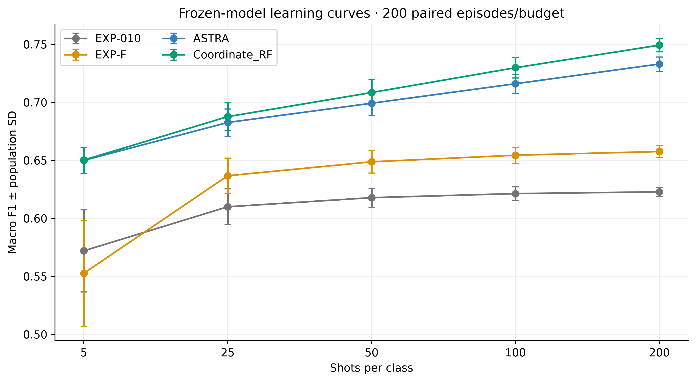
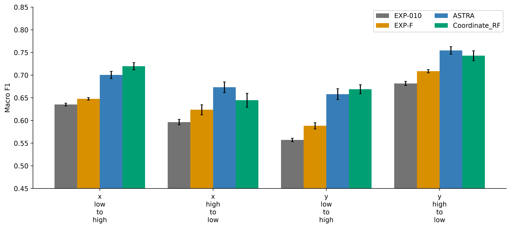

# Results

## Locked random-pixel evaluation
Mean macro F1 ± population SD, 200 paired episodes per budget. All query sets exclude the 800-label development bank. These are not independent-city test results.

| Shots/class | Coordinate_RF | Gain vs ASTRA | Wins vs ASTRA |
|---|---|---|---|
| 5 | 0.650253 ± 0.011246 | +0.000289 | 106/200 |
| 25 | 0.687664 ± 0.012145 | +0.005045 | 171/200 |
| 50 | 0.708436 ± 0.011277 | +0.009213 | 193/200 |
| 100 | 0.729839 ± 0.008802 | +0.013803 | 200/200 |
| 200 | 0.749299 ± 0.005716 | +0.016262 | 200/200 |

At 200 shots/class, paired ASTRA scores 0.733037, EXP-F 0.657602 and EXP-010 0.622840. Coordinate_RF's mean gains are +0.016262, +0.091697 and +0.126459 respectively. [Full learning curves](../tables/learning_curve.md) and [leaderboard](../tables/leaderboard.md) retain unrounded values and uncertainty.

## Paired evidence
Against ASTRA at 200 shots, the conditional paired-bootstrap 95% mean-gain interval is [0.015856, 0.016669]. Paired Cohen dz is 5.601; this large value reflects small *within-pair* support-sampling variability, not a transferable city-level effect. Both paired t and Wilcoxon tests remain below 0.001 after Holm adjustment. At five shots the gain interval includes zero (approximately [-0.000077, 0.000667]); paired t p=0.125 and Wilcoxon p=0.255. Meaningful five-shot superiority is not supported.

[All tests and effect sizes](../tables/significance.md) are conditional on one fixed city and shared query population. Historical model selection and spatial dependence prevent interpreting small p-values as independent-test superiority.

## Geographic trade-off
Coordinate_RF's four-direction mean is 0.694216 versus ASTRA's 0.696672, with worst-direction means 0.644816 versus 0.658183. High-x support → low-x query loses approximately 0.028670. The x-half means are 0.682326 versus 0.687017; y-half means are 0.706106 versus 0.706326. This is a material limitation, not hidden by the random-pixel headline.

See [spatial report](SPATIAL_ANALYSIS.md), [directional/summary table](../tables/spatial.md) and [matched directional gains](../tables/spatial_matched_control.md). Random-pixel controls use a different query geography.

## Class, mechanism and runtime diagnostics
- [Per-class metrics](../tables/per_class.md) and [confusion counts](../tables/confusion.md) cover all models/budgets; counts are repeated query appearances. Normalized matrices and per-class images use 200 shots.
- [Development ablations](../tables/ablation.md) preserve existing five-fold experiments. RF, covariance, graph, adaptive shrinkage and source-prior mechanisms are operationally entangled; bars are not additive causal contributions.
- [Transfer stages](../tables/transfer.md) show saved/internal source-only, local target-only, pre-graph blend, ASTRA and Coordinate_RF probabilities on one fixed episode. No stage was tuned or promoted.
- [Runtime](RUNTIME_REPORT.md) separates historical four-model call timings from fresh, profiled, exact-reference replays. CPU/RSS and local RF fit/predict measurements are available for the two RF methods; missing historical instrumentation is not inferred.
- [Feature importance](../tables/feature_importance.md), coordinate split usage, covariance spectra and [calibration](../tables/calibration.md) are descriptive. Whitened axes must not be relabelled as original spectral features.

## Discussion and reproducibility
Coordinate_RF remains the development-locked packaged model for this random-pixel/full-pool use case, not a universal winner. Historical ASTRA's earlier 0.735239 remains historical; it used a different protocol. The publication build recomputed all 4,000 confusion/metric records from saved predictions and confirmed support/development exclusions. Ten fresh fixed-reference prediction arrays matched exactly. The previously completed full fresh-source replay remains preserved, not rerun.

The [figure manifest](../publication/FIGURE_MANIFEST.json) provides captions and PNG/SVG/PDF paths. [Diagnostic limitations](DIAGNOSTIC_LIMITATIONS.md) and [methods](METHODS.md) define the scope of every claim.
