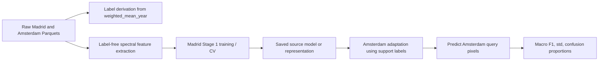

# Member 4 Phase 1 Judging Pack

**Owner:** Member 4 — Research & Presentation Engineer  
**Status:** Phase 1 scaffold. Results placeholders only unless labelled as starter reference.  
**Rule:** Do not add final numbers until run owner/Team Lead marks evidence as verified.

## 1. Organiser requirements extracted from current docs

### Required technical deliverables

- Madrid Stage 1 model trained on Madrid/source data.
- Amsterdam adaptation code/notebook/script that consumes Stage 1 state and labelled support data.
- Configurable Amsterdam labels per class: provisional budgets **5, 25, 50, 100, 200** labels/class.
- Fixed seeds and runnable, reproducible end-to-end execution.
- Madrid macro F1 mean/std and confusion-matrix proportions.
- Amsterdam repeated-evaluation macro F1 mean/std at required budgets.
- PowerPoint presentation with:
  - first-slide abstract no more than 150 words,
  - model/design decisions,
  - successes/failures,
  - results table,
  - error bars,
  - F1 versus log2(sample size) learning curve.
- Written justification covering model design, transfer strategy, and F1 interpretation; provisional target **≤300 words** pending clarification.

### Required scientific constraints

- Task is four-class classification, not regression or five-class classification.
- Source city is Madrid; target city is Amsterdam.
- Adaptation must be genuine transfer, not only target-only fitting.
- Macro F1 is the primary metric; do not substitute accuracy or weighted F1.
- Amsterdam support labels may be used for adaptation; query labels are evaluation-only.
- Exclude `weighted_mean_year`, `age_class`, and any construction-year-centred features from predictive inputs.
- Keep geographic pixels grouped correctly; `pixel_id` is a pixel-year identifier.
- Save/reload preprocessing, model/representation, feature schema, seeds, and configuration.

## 2. Judging checklist

| Rubric area | Points | What judges need to see | Evidence placeholder |
|---|---:|---|---|
| Challenge understanding and transfer strategy | 30 | Clear domain-shift explanation; Madrid-trained state reused in Amsterdam; low-data mechanics; support/query separation; honest limitations | [pending Team Lead/Member 3 evidence] |
| Originality and solution creativity | 40 | One problem-specific hypothesis; controlled ablation; why the method is tailored to cross-city spectral transfer; insightful failures if any | [pending authorised candidate story] |
| Presentation and collaboration | 30 | Coherent story; all four members speak; correct interpretation of F1/error bars; reproducible package evidence | [pending speaking role confirmation] |
| Deduction avoidance | up to -5/-20/DQ | Word limits; all three pillars covered; no leakage; no off-topic method; professional conduct | [Member 4 checklist] |

### Compliance gate before final slides

- [ ] Every metric has evidence source, owner, reviewer, seed/config, and status.
- [ ] Starter notebook scores are labelled **starter reference**, not team-reproduced results.
- [ ] Standard deviation is described as spread across folds/episodes, not confidence interval.
- [ ] Confusion matrix rows are described as recall/proportions, not F1.
- [ ] Claims of transfer are backed by source-state reuse and target-only comparison.
- [ ] Limitations include hidden-test uncertainty and two-city scope.

## 3. Presentation structure

1. **Title + abstract** — 150-word abstract, team names, one-sentence contribution.
2. **Problem and impact** — Building-era classification in 30 m Landsat pixels; relevance to planning, energy, infrastructure, risk.
3. **Data and labels** — Madrid source, Amsterdam target, four age classes, weighted-mean-year labels, mixed-pixel uncertainty.
4. **Why transfer is hard** — City history, class imbalance, seasonal/sensor/domain shift, few labels in Amsterdam.
5. **Baseline pipeline** — Raw data → QA/feature extraction → Madrid model → Amsterdam support/query evaluation.
6. **Transfer gap in starter baseline** — Raw Amsterdam prototypes are useful baseline but not a supervised Madrid-transfer proof.
7. **Candidate method placeholder** — [Insert authorised final method only after Member 3/Team Lead evidence].
8. **Evaluation protocol** — Madrid CV; Amsterdam repeated support/query episodes; budgets; macro F1; seeds.
9. **Results table placeholder** — Madrid mean/std and Amsterdam budgets; status labels on all numbers.
10. **Learning curve placeholder** — Macro F1 vs log2(labels/class), with error bars and trial counts.
11. **Ablation/insight slide** — Transfer vs target-only, feature/season/quality insight, or honest failed experiment.
12. **Limitations and risk controls** — Leakage prevention, query labels isolated, label-free inference, spatial/season caveats.
13. **Reproducibility and artifacts** — Saved Stage 1 model, adaptation code, schema, seeds, clean-session/reload checks.
14. **Team contributions** — All four roles and speaking transitions.
15. **Takeaway** — What the team proved, what remains uncertain, and why the approach is defensible.

## 4. Draft abstract placeholder (≤150 words)

**DRAFT — replace method/results only after verification.**

We address the challenge of transferring building-era classification from Madrid to Amsterdam using multiyear Landsat observations and only a small labelled Amsterdam support set. Each 30 m pixel is assigned to one of four construction-era classes derived from weighted building years. Our workflow separates label creation from label-free feature generation, trains a Madrid Stage 1 representation, and adapts to Amsterdam using support labels while holding query labels for evaluation only. We report macro F1 because each class matters equally, especially under class imbalance and low-data conditions. The presentation explains the baseline pipeline, the domain-shift risks, our validated transfer strategy, and the evidence used to compare methods across label budgets. Final results, ablations, and limitations will be inserted only after verified runs and artifact reload checks.

Word count: 124.

## 5. Written justification outline (≤300-word target)

1. **Model design:** What features/representation/model were used; why suitable for multiyear spectral data and four-class macro F1.
2. **Transfer strategy:** How Madrid-trained state is reused; how Amsterdam support labels adapt the model; how query leakage is prevented.
3. **F1 interpretation:** Macro F1 mean/std across Madrid folds and Amsterdam episodes; trends over 5/25/50/100/200 labels/class; what improved, failed, or remained uncertain.
4. **Limitations:** Two-city evidence only; mixed-pixel labels; seasonal/sensor confounding; hidden-test assumptions.

## 6. Technical story: baseline pipeline

Baseline explanation for judges:

- The data contain repeated Landsat observations for each geographic pixel.
- Labels are four construction-era classes derived from weighted construction year.
- Preprocessing turns many yearly observations into one fixed-length feature vector per geographic pixel.
- Stage 1 learns from Madrid only.
- Adaptation receives a small balanced Amsterdam support sample and must predict held-out Amsterdam query pixels.
- Evaluation uses macro F1 so performance on minority classes still matters.

Important baseline caveat:

- The starter raw-feature prototype method uses Amsterdam support labels directly and does not use the trained Madrid Random Forest as the adaptation representation. It is a useful target few-shot baseline, but not by itself proof of supervised Madrid transfer.

## 7. Beginner-friendly explanations

- **Pixel:** A small square area on the map, about 30 m by 30 m.
- **Spectral bands:** Satellite measurements in colours humans can see and infrared wavelengths we cannot see.
- **Construction-era class:** A broad age category for buildings in the pixel, not an exact year.
- **Transfer learning:** Learn useful patterns in Madrid, then reuse them in Amsterdam where labels are scarce.
- **Support set:** The few labelled Amsterdam examples allowed for adaptation.
- **Query set:** Amsterdam examples used only to test predictions.
- **Macro F1:** A score that gives equal importance to all four classes, even if one class has fewer pixels.
- **Domain shift:** Madrid and Amsterdam differ in urban form, history, weather, seasons, sensors, and class distribution, so a Madrid model may not work directly.
- **Leakage:** Accidentally using the answer, or information from test labels, during training.

## 8. Current assumptions to state if asked

- Use Madrid → Amsterdam transfer and four classes.
- Use right-inclusive class intervals implemented in starter notebooks until organisers clarify.
- Support all five provisional budgets: 5, 25, 50, 100, 200 labels/class.
- Keep written justification at or below 300 words pending 300 vs 500-word clarification.
- Treat all final metrics as pending until reproduced, reviewed, and linked to artifacts.
- Do not claim hidden-test or global performance beyond evidence.

## 9. Evidence checklist / placeholders

| Evidence item | Needed from | Status | Notes |
|---|---|---|---|
| Official organiser clarifications | Team Lead | Pending | Budgets, word limit, submission format, hidden evaluation protocol |
| Baseline reproduction result | Member 2 / Team Lead | Pending | Do not use starter numbers as reproduced evidence |
| Feature schema and label-free inference proof | Member 2 | Pending | Include feature count, horizon, excluded columns |
| Madrid Stage 1 artifact path/checksum | Member 3 | Pending | Must include saved preprocessing/representation state |
| Amsterdam adaptation script/notebook path | Member 3 | Pending | Configurable labels/class and fixed seed |
| Matched episode definitions | Team Lead | Pending | Support/query split IDs and trial count |
| Amsterdam results table | Run owner / Team Lead | Pending | Mean/std for required budgets only after review |
| Learning-curve figure | Run owner / Member 4 | Pending | Use verified machine-readable result table |
| Ablation evidence | Members 2/3 | Pending | Transfer vs target-only; feature/candidate insight |
| Clean-session reload check | Member 4 or reviewer | Pending | Pass/fail record only; do not alter model code |
| Final PPT/PDF | Member 4 | Draft scaffold | Offline open check required |
| Written justification | Member 4 + Team Lead | Outline only | Fill after final verified method/results |

## 10. Questions judges might ask

1. What exactly was learned from Madrid, and where is it reused in Amsterdam?
2. How do you know the method is transfer learning rather than target-only few-shot fitting?
3. Why macro F1 instead of accuracy?
4. How did you prevent Amsterdam query labels from influencing the model?
5. Why is 25 labels per class important?
6. What are the biggest sources of domain shift between Madrid and Amsterdam?
7. How are mixed pixels and weighted construction-year labels handled?
8. Which classes are hardest, and why? [Answer only with verified per-class evidence.]
9. What does the error bar represent?
10. Can your saved model run from a clean session without labels?
11. What ablation shows your original contribution helped or taught something?
12. What would you change with more time or more labelled Amsterdam data?
13. Are confidence maps calibrated probabilities? [Do not claim calibration unless tested.]
14. Does this generalise worldwide? [Answer: not proven; evidence is two-city transfer only.]

## 11. Team speaking-role plan

- **Member 1 / Lead:** Problem, rules, evaluation protocol, final conclusion.
- **Member 2 / Data:** Dataset, labels, feature generation, quality/season/domain-shift risks.
- **Member 3 / Model:** Madrid Stage 1, transfer/adaptation mechanics, ablations.
- **Member 4 / Presentation:** Results interpretation, reproducibility evidence, limitations, team contribution slide.

## 12. Missing evidence requests

### Request to Member 2

- Confirm feature pipeline status and whether transformation is label-free.
- Provide final feature schema/horizon and excluded-label-column list.
- Provide any verified QA/season/feature ablation evidence authorised for slides.

### Request to Member 3

- Provide plain-English method explanation once candidate is authorised.
- Provide saved artifact paths/checksums and reload requirements.
- Provide transfer-vs-target-only comparison status.

### Request to Team Lead

- Confirm organiser clarifications and final requirement interpretation.
- Confirm which metrics/figures are verified for presentation use.
- Confirm speaking order and time limit.
