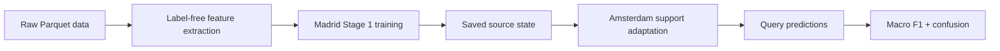

# Presentation Outline — Draft Scaffold

**Status:** Draft structure with placeholders. Do not add final results until verified.

## Slide 1 — Title and abstract

- Team name and members.
- Abstract ≤150 words.
- One-sentence claim: *validated transfer pipeline for Madrid → Amsterdam few-shot building-era classification*.

## Slide 2 — Why this matters

- Building-age information supports planning, maintenance, energy policy, and risk assessment.
- Many cities have limited labels; transfer learning reduces local labelling burden.

## Slide 3 — Task and labels

- Input: multiyear Landsat observations for each 30 m × 30 m pixel.
- Output: class 1–4 construction-era label.
- Label source: weighted mean construction year binned into city-specific intervals.
- Note mixed-pixel uncertainty and class imbalance.

## Slide 4 — Domain shift

- Madrid source vs Amsterdam target.
- Few labelled Amsterdam pixels.
- Potential shifts: urban history, class distribution, season, sensor, coverage, materials, vegetation.

## Slide 5 — Evaluation protocol

- Madrid: cross-validation macro F1 mean/std and confusion proportions.
- Amsterdam: repeated support/query episodes at 5, 25, 50, 100, 200 labels/class.
- Query labels used only after prediction.
- Error bars = standard deviation across episodes/folds.

## Slide 6 — Baseline pipeline

Speaker note: starter raw prototypes are a target few-shot baseline, not sufficient proof of supervised transfer.

## Slide 7 — Candidate transfer method placeholder

- [Insert authorised method name.]
- What is learned on Madrid: [placeholder].
- What is adapted using Amsterdam support labels: [placeholder].
- Why designed for low-data transfer: [placeholder].

## Slide 8 — Originality / hypothesis

- Problem-specific hypothesis: [placeholder after Team Lead authorises].
- Controlled comparison: target-only baseline vs source-learned transfer.
- If result is negative, explain what it teaches.

## Slide 9 — Results table placeholder

| Method | Madrid CV macro F1 mean±std | AMS 5/class | AMS 25/class | AMS 50/class | AMS 100/class | AMS 200/class | Status |
|---|---|---|---|---|---|---|---|
| Starter reference baseline | see report; not reproduced | see report | see report | see report | see report | see report | starter reference only |
| Reproduced baseline | pending | pending | pending | pending | pending | pending | placeholder |
| Final candidate | pending | pending | pending | pending | pending | pending | placeholder |

## Slide 10 — Learning curve placeholder

- Plot macro F1 versus log2(labels/class).
- Include mean, standard deviation, number of trials.
- Highlight 25 labels/class only with verified evidence.

## Slide 11 — Error analysis placeholder

- Per-class confusion/recall patterns: [pending verified data].
- Most important failure modes: [pending verified data].
- Do not claim class-specific weakness until evidence exists.

## Slide 12 — Reproducibility and leakage controls

- Saved Stage 1 artifact and preprocessing/schema state.
- Configurable adaptation budget and fixed seeds.
- Support/query separation.
- Label-free inference check.
- Clean-session reload check.

## Slide 13 — Limitations

- Hidden test set unavailable.
- Two-city transfer only; not proof of global portability.
- Weighted-mean-year labels may not equal majority building era.
- Seasonal/sensor/radiometry caveats.
- Unconfirmed organiser details remain tracked.

## Slide 14 — Team contributions

- Member 1: requirements, evaluation, integration.
- Member 2: data QA/features.
- Member 3: model/transfer/adaptation.
- Member 4: evidence, slides, reproducibility, Q&A prep.

## Slide 15 — Final takeaway

- [One evidence-backed conclusion after final results are verified.]
- [One honest limitation.]
- [One practical next step.]
