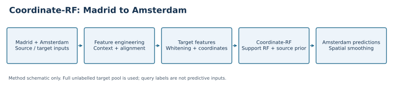
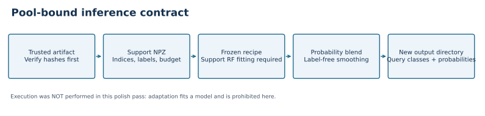
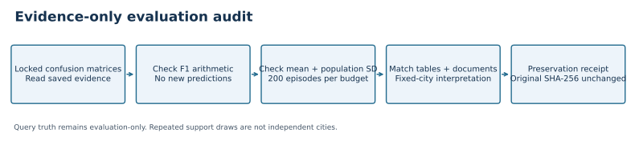
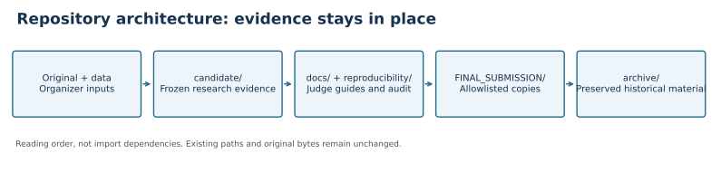

# Pipeline and repository architecture

| Boundary | Inputs | Contract |
|---|---|---|
| Source learning (historical) | Madrid features, labels, coordinates | No target query truth |
| Pool binding (historical) | Ordered Amsterdam features and coordinates | Full-pool transductive preprocessing |
| Adaptation (not run here) | Frozen state, support rows and labels, budget | Fits a support RF; disjoint queries |
| Prediction (not run here) | Adapted branch + source prior | Four probability columns, classes 1–4 |
| Evidence audit (this pass) | Saved matrices, summaries and files | Read-only arithmetic and integrity checks |

## Layout policy
Keep existing `candidate/`, `working/`, `original/`, `data/`, `presentation/` and
`archive/` paths intact to protect imports and hash manifests. Do not introduce
empty `src/`, `models/`, `tables/` or `autonomous_runs/` duplicates for appearance.
Current implementations, models, tables and runs already live under `candidate/`.
The new `FINAL_SUBMISSION/` has only requested deliverable categories; notebook
runtime dependencies live under its `model/` directory. New schematic SVG/PNG
assets live under `figures/repository_polish/`, separate from locked result figures.
